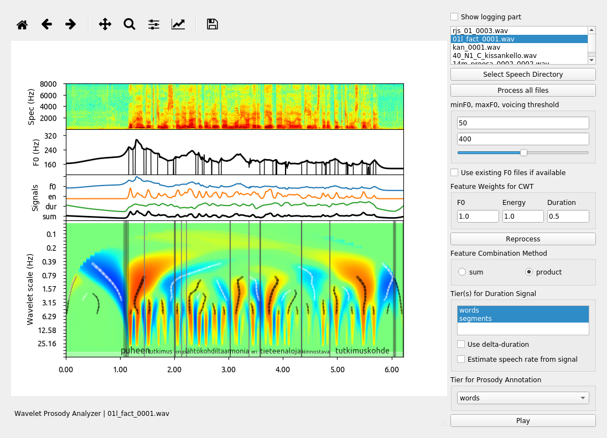

|github-actions-badge|_

.. |github-actions-badge| image:: https://github.com/asuni/wavelet_prosody_toolkit/actions/workflows/check-toolkit.yaml/badge.svg?branch=travis2github-actions
.. _github-actions-badge: https://github.com/asuni/wavelet_prosody_toolkit/actions?query=check-wavelet-prosody-toolkit

Wavelet prosody analyzer
========================

antti.suni@helsinki.fi

**UPDATE 3.2.2020**, Additional command-line tools: **batch-processing, global spectrum and analysis-synthesis:** `tools.rst <tools.rst>`__.

|screenshot|

Description
-----------

The program calculates f0, energy and duration features from speech
wav-file, performs continuous wavelet analysis on combined features,
finds prosodic events (prominences, boundaries) from the wavelet
scalogram and aligns the events with transcribed units.

See also:

[1] Antti Suni, Juraj Šimko, Daniel Aalto, Martti Vainio, Hierarchical
representation and estimation of prosody using continuous wavelet
transform, Computer Speech & Language, Volume 45, 2017, Pages 123-136,
ISSN 0885-2308, https://doi.org/10.1016/j.csl.2016.11.001.

The default settings of the program are roughly the same as in the
paper, duration signal was generated from word level labels.

Requirements
------------

The wavelet prosody analysis depends on several packages which are installed automatically if you
use the procedure describe in `./INSTALL.rst <INSTALL.rst>`__.

Here are the main dependencies:

-  **pycwt** for the wavelet analysis (see https://github.com/regeirk/pycwt/LICENSE.txt )
-  **pyyaml** for the configuration (see https://github.com/yaml/pyyaml/blob/master/LICENSE )
-  **soundfile** for playing waves (see https://github.com/bastibe/SoundFile/blob/master/LICENSE )
-  **wavio** for reading/writing wav (see https://github.com/WarrenWeckesser/wavio/blob/master/README.rst )
-  **tgt** for reading/writing textgrid (see https://github.com/hbuschme/TextGridTools/blob/master/LICENSE )
-  **pyqt5** for the gui (see https://www.riverbankcomputing.com/commercial/pyqt )
-  **matplotlib** for the plot rendering (see https://github.com/matplotlib/matplotlib/blob/master/LICENSE/LICENSE )

Here the optional dependencies:

-  **pyreaper** for the f0 extraction (see https://github.com/r9y9/pyreaper/blob/master/LICENSE.md ).

**The user is invited to have a look at the license of the dependencies.**

Installation
------------

see `./INSTALL.rst <INSTALL.rst>`__

Input information
-----------------

-  audio files in wav format
-  transcriptions in either htk .lab format or Praat textgrids

Usage:
------

1. Assuming the installation process is done in **global mode**, just do

.. code:: sh

	  wavelet_gui

Otherwise, go to the root directory of the program in the terminal, and start by

.. code:: sh

    python3 wavelet_prosody_toolkit/wavelet_gui.py

2. Select directory with speech and transciption files:
   ``Select Speech Directory...``. Some examples are provided in
   ``samples/`` directory. Files should have the same root, for example
   file1.wav, file1.lab or file2.wav file2.TextGrid.

3. Select features to use in analysis: ``Prosodic Feats for CWT..``

4. Adjust Pitch tracking parameters for the speaker / environment, press
   ``Reprocess`` to see changes Set range for possible pitch values,
   typically males ~50-350Hz, females ~100-400Hz. If estimated track
   skips obviously voiced portions, move voicing threshold slider left.

-  Alternatively, pre-estimated f0 analyses can be used: file .f0 must
   exist and it should be either in praat matrix format or as a list
   file with one f0 value / line, frame shift must be constant 5ms. To
   get suitable format from Praat, select wav and do:

   -  To Pitch: 0.005, 120, 400
   -  To Matrix
   -  Save as matrix text file: “/.f0”

5. Adjust the weights of prosodic features and choose if the final
   signal is combined by summing or multiplying the features

6. Select which tiers to use for durations signal generation / use
   duration estimated from signal

7. Select transcription level of interest: ``Select Tier``

8. You can interactively zoom and move around with the button on top,
   and play the visible section

9. When everything is good, you can ``Process all`` which analyzes all
   utterances in the directory with the current settings, and saves
   prosodic labels in the speech directory as ``<wav_file_name>.prom``

Prosodic labels are saved in a tab separated form with the following
columns:

.. code::

    <file_name> <start_time> <end_time> <unit> <prominence strength> <boundary strength>

Advanced Usage:
---------------

Additional customization of the input signals and wavelet analysis is possible by modifying the configuration file. The default configuration is located in:

.. code:: sh

	  wavelet_prosody_toolkit/configs/default.yaml

You can view an online version here: https://github.com/asuni/wavelet_prosody_toolkit/blob/master/wavelet_prosody_toolkit/configs/default.yaml

You are recommended to make a copy of the default.yaml file (to e.g. myconfig.yaml), and modify the copy.  To apply the modified configuration, start the program by

.. code:: sh

	  wavelet_gui --config path/to/myconfig.yaml

Some helpful shortcuts
----------------------

Here are a list of shortcuts available in the GUI:

- **CTRL+q** to quit
- **F11** to switch between fullscreen et normal mode
