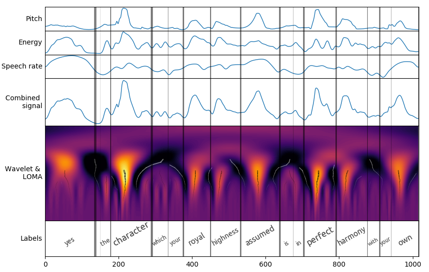
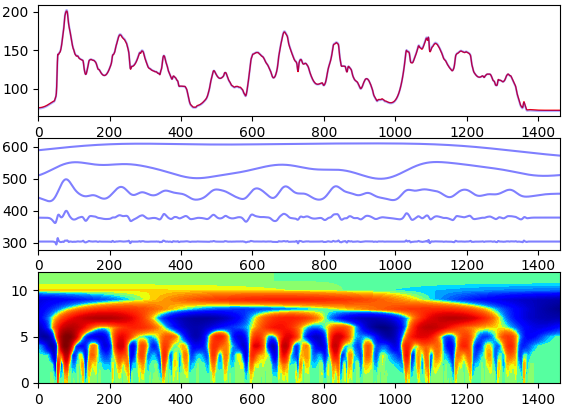
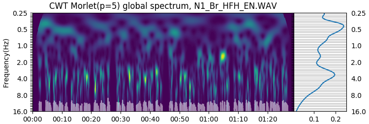

Additional tools for prosody processing with wavelets
-----------------------------------------------------

Besides the graphical Wavelet Prosody Analyzer, the repository contains additional command-line tools related to prosody processing with wavelets, described below.
Precise usage of the tools can be checked by running the tools with the --help flag, for example:

.. code:: sh
	  
   python3 cwt_analysis_synthesis.py --help

|
|

**prosody_labeller.py**

		   
This tool provides the same functionality as the graphical wavelet prosody analyzer. With parallel processing and no graphical overhead, it is suitable for processing large speech corpora. We also provide configuration files fine-tuned for English prominence and boundary estimation. Try:

.. code:: sh

   python3 prosody_labeller.py samples/libritts --config configs/libritts.yaml

or
   
.. code:: sh

   python3 prosody_labeller.py samples/libritts --config configs/libritts_boundary.yaml
	  

*Talman A, Suni A, Celikkanat H, Kakouros S, Tiedemann J, Vainio M. Predicting Prosodic Prominence from Text with Pre-trained Contextualized Word Representations. Nordic Conference of Computational Linguistics. 2019 Aug 9.*

*Antti Suni, Juraj Šimko, Daniel Aalto, Martti Vainio, Hierarchical representation and estimation of prosody using continuous wavelet transform, Computer Speech & Language, Volume 45, 2017, Pages 123-136, ISSN 0885-2308, https://doi.org/10.1016/j.csl.2016.11.001.*

|
|

**cwt_analysis_synthesis.py**

	
This tool demonstrates how F0 can be decomposed to temporal scales which can be associated to phonological levels, and how the original F0 contour can be reconstructed from these scales.

*Suni, A. S., Aalto, D., Raitio, T., Alku, P., & Vainio, M. (2013). Wavelets for intonation modeling in HMM speech synthesis. In A. Bonafonte (Ed.), 8th ISCA Workshop on Speech Synthesis, Proceedings, Barcelona, August 31 - September 2, 2013 (pp. 285-290). Barcelona: ISCA.*

|
|

**cwt_global_spectrum.py**

		   
This script extracts global wavelet spectrum of the speech envelope, similar to amplitude modulation spectrum.

*Suni , A , Kallio , H , Benus , S & Šimko , J 2019 , Characterizing second language fluency with global wavelet spectrum . in S Calhoun , P Escudero , M Tabain & P Warren (eds) , Proceedings of the 19th International Congress of Phonetic Sciences, Melbourne, Australia.*

